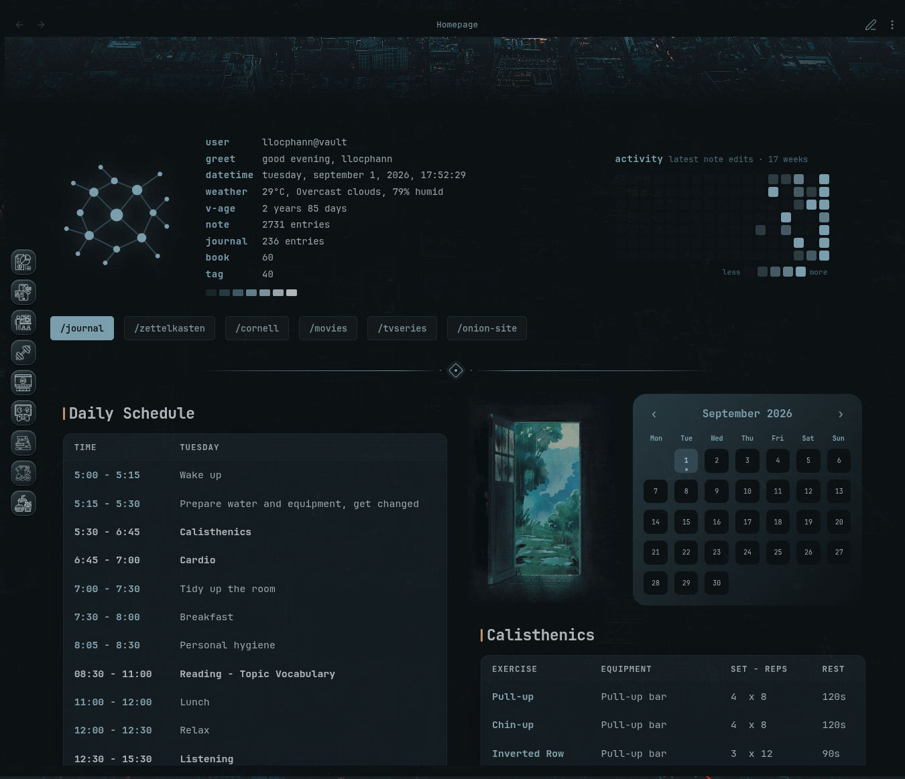
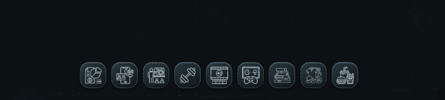

# Ledge

Ledge adds configurable navigation docks to the edges and corners of your Obsidian workspace. Multiple named Dock presets can remain available at the same time while you move between notes, Bases, canvases, and Custom Views.

<p align="center">
  
</p>

<p align="center">
  <sub>Dock in my theme</sub>
</p>

## Dock

<p align="center">
  
</p>

## Features

- Up to eight named Dock presets that can render simultaneously.
- Exclusive placement across left, right, top, bottom, and four 90-degree corner positions.
- Add, duplicate, rename, select, enable or disable, and delete Dock presets.
- Each Dock keeps its own layout, behavior, visibility rules, trigger, appearance, and items.
- Configurable item size, icon size, gap, padding, radius, and edge offset.
- Theme-aware, solid, and gradient surfaces.
- Independent controls for the shared Dock background and outer border.
- Adjustable reveal delay, hide delay, trigger size, and motion duration.
- Optional macOS-style focused and neighboring item magnification.
- Unified searchable built-in icon picker with Obsidian/Lucide, Tabler Icons, Material Design Icons, Phosphor, and Bootstrap Icons.
- Per-item icon size, icon color, and tile gradient overrides.
- Add, disable, remove, and reorder shortcuts.
- Pointer drag-and-drop plus `Alt` + arrow keyboard reordering.
- Same-leaf navigation that does not open an extra tab.
- Pop-out window support with automatic lifecycle cleanup.
- Dock-first settings that keep every Dock-specific option inside one preset context.

## Configure Ledge

Open **Settings → Community plugins → Ledge**. Ledge uses one continuous settings page. Dock configuration comes first, **Data** follows the Dock settings, and **About** stays at the bottom with the current plugin **Version** and **Author** read from `manifest.json`.

At the top of **Docks**, every preset is represented by one compact button. The `+` button always appears after the last preset and creates the next Dock. Selecting another preset changes the whole editing context. Rename, duplicate, and delete actions remain available for the selected preset without adding extra controls to the preset switcher itself.

The selected Dock exposes:

- **Items** — shortcuts, target paths, built-in or vault icons, and per-item overrides;
- **Layout** — enabled state, exclusive position, item/icon size, gap, padding, radius, and edge offset;
- **Behavior** — auto-hide, motion, magnification, and labels;
- **Visibility** — include/exclude context rules;
- **Trigger** — activation area, reveal timing, and trigger-pill appearance;
- **Appearance** — Dock surface, border, accent, and gradient controls.

Every preset receives one of the eight available positions. A position already used by another preset is removed from that Dock's **Position** dropdown, including when the other preset is disabled. Deleting a preset releases its position again.

For **Top** and **Bottom**, Ledge anchors the Dock and its trigger to the active view's content area. The upper corner positions use the same note-area anchoring so they stay inside the active view.

Existing single-Dock configurations are migrated automatically into **Dock 1** without changing their items, position, visibility rules, trigger, or appearance settings.

Every Dock item has:

- a label;
- a vault-relative target path;
- either an icon chosen from the unified built-in icon picker, a manually entered Obsidian icon ID, or a vault-relative icon path;
- optional icon size, color, and tile gradient overrides.

Select **Browse icons** to search Obsidian/Lucide, Tabler Icons, Material Design Icons, Phosphor, and Bootstrap Icons. External collections are fetched from Iconify when first selected and retained in Ledge's plugin data so previously selected icons continue to work offline.

Switching between **Built-in icon** and **Icon in vault** preserves the previous value for each source.

## Backup and migration

Settings exports use schema v2 so one backup contains every Dock preset. Ledge still accepts schema-v1 backups from the previous single-Dock format and migrates them into one preset during import.

## Install manually

1. Create `.obsidian/plugins/ledge/` inside the vault.
2. Copy `main.js`, `manifest.json`, and `styles.css` into that folder.
3. Reload Obsidian.
4. Enable **Ledge** under **Settings → Community plugins**.

## Development

Node.js 22 or newer is required for the development toolchain.

```bash
npm install
npm run check
