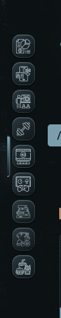
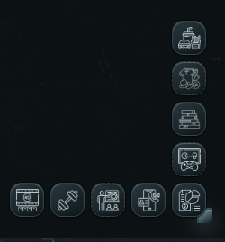

# Ledge

Ledge adds configurable navigation docks to the edges and corners of your Obsidian workspace. Multiple named Dock presets can remain available at the same time while you move between notes, Bases, canvases, and Custom Views.

<p align="center">
  
  
</p>

## Features

- Up to eight named Dock presets that can render simultaneously.
- Exclusive placement across left, right, top, bottom, and four 90-degree corner positions.
- Add, duplicate, rename, select, enable or disable, and delete Dock presets.
- Each Dock keeps its own layout, behavior, visibility rules, trigger, appearance, and items.
- Configurable item size, icon size, gap, padding, radius, and edge offset.
- Theme-aware, solid, and gradient surfaces.
- Independent controls for the shared Dock background and outer border.
- Adjustable reveal delay, hide delay, trigger size, and motion duration.
- Optional macOS-style focused and neighboring item magnification.
- Unified searchable built-in icon picker with Obsidian/Lucide, Tabler Icons, Material Design Icons, Phosphor, and Bootstrap Icons.
- Per-item icon size, icon color, and tile gradient overrides.
- Add, disable, remove, and reorder shortcuts.
- Pointer drag-and-drop plus `Alt` + arrow keyboard reordering.
- Same-leaf navigation that does not open an extra tab.
- Pop-out window support with automatic lifecycle cleanup.
- Tabbed settings for faster navigation between layout, behavior, appearance, items, and support.

## Configure Ledge

Open **Settings → Community plugins → Ledge**. The **Layout** section shows every Dock as a card instead of hiding presets inside a dropdown. Open a card to edit that Dock's name, enabled state, position, item size, icon size, gap, padding, corner radius, and edge offset. The Dock whose card is open becomes the selected Dock, so the **Behavior**, **Visibility**, **Trigger**, **Appearance**, and **Items** sections edit that same Dock.

Use **Add dock** to create another Dock or the copy action on a Dock card to duplicate it. Every preset receives one of the eight available positions. A position already used by another preset is removed from that Dock's **Position** dropdown, including when the other preset is disabled. Deleting a preset releases its position again.

Existing single-Dock configurations are migrated automatically into **Dock 1** without changing their items, position, visibility rules, trigger, or appearance settings.

Every Dock item has:

- a label;
- a vault-relative target path;
- either an icon chosen from the unified built-in icon picker, a manually entered Obsidian icon ID, or a vault-relative icon path;
- optional icon size, color, and tile gradient overrides.

Select **Browse icons** to search a grid where each result shows only its icon and readable name. Obsidian/Lucide icons come from the local Obsidian icon registry. Tabler Icons, Material Design Icons, Phosphor, and Bootstrap Icons are queried from Iconify on demand. Search and first-time selection of those external collections require a network connection, but Ledge stores retained external icon choices from every Dock preset in its plugin data. Cached icons are registered again before the Docks start after a reload, so previously selected icons continue to render offline without shipping thousands of SVG files in `main.js`.

For an icon stored in the vault, choose **Tint** to recolor a transparent icon with the active accent or **Original colors** to preserve the source image. Switching between **Built-in icon** and **Icon in vault** preserves the previously selected value for each source. If that remembered vault icon or one of its parent folders is renamed, Ledge updates the stored path even while the item is currently using a built-in icon.

## Backup and migration

Settings exports use schema v2 so one backup contains every Dock preset. Ledge still accepts schema-v1 backups from the previous single-Dock format and migrates them into one preset during import.

## Install manually

1. Create `.obsidian/plugins/ledge/` inside the vault.
2. Copy `main.js`, `manifest.json`, and `styles.css` into that folder.
3. Reload Obsidian.
4. Enable **Ledge** under **Settings → Community plugins**.

## Development

Node.js 22 or newer is required for the development toolchain.

```bash
npm install
npm run check
```

The release files are `main.js`, `manifest.json`, and `styles.css`. GitHub release tags must match the manifest version exactly without a `v` prefix.

## Support

If Ledge is useful to you, you can support its continued development:

<a href="https://www.buymeacoffee.com/llocphann">
  
</a>

## License

Ledge is licensed under the GNU General Public License v3.0 only.
